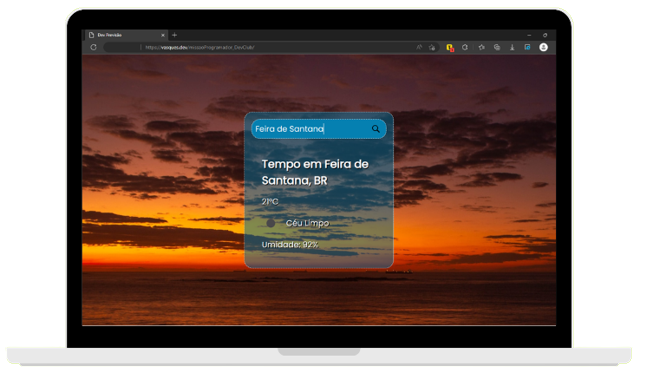

<h1 align="center">
Previsão do Tempo / Weather Forecast
</h1>

  

 

&nbsp;
 &nbsp;
 

 

# 📰 Description / Descrição

🇺🇸 - Page created in the 'Programmer Mission' immersion promoted by [Rodolfo Mori](https://www.instagram.com/rodolfomorii/) from the DevClub platform, where the objective was to develop a page from scratch, from HTML, through CSS and up to o Javascript. A connection was made to an external API ([OpenWeather](https://openweathermap.org/)) where we extracted the name of the researched city, temperature, climate conditions and air humidity from data obtained in JSON format.

 

🇧🇷 - Página criada na imersão 'Missão Programador' promovido por [Rodolfo Mori](https://www.instagram.com/rodolfomorii/) da plataforma DevClub, onde o objetivo foi desenvolver uma página do zero, desde o HTML, passando pelo CSS e chegando até o Javascript. Foi realizada conexão com API externa ([OpenWeather](https://openweathermap.org/)) onde extraímos o Nome da Cidade pesquisada, Temperatura, Condições Climáticas e Umidade do Ar a partir de dados obtidos em formato JSON.

 

# 👷🔧 Built With / Construído Com

🇺🇸 - This project was built using these technologies: 
🇧🇷 - Este Projeto foi construído utilizando essas tecnologias:
- HTML5
- CSS3
- Javascript

 

# ✨ Features / Recursos
## 🇺🇸
- 🖼️ Dynamic Background;
- 📱 Fully Responsive;

## 🇧🇷
- 🖼️ Background Dinâmico;
- 📱 Totalmente Responsivo;

# 

